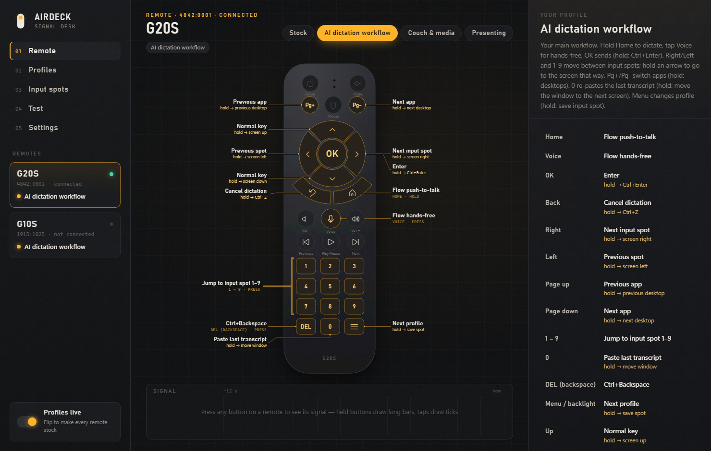
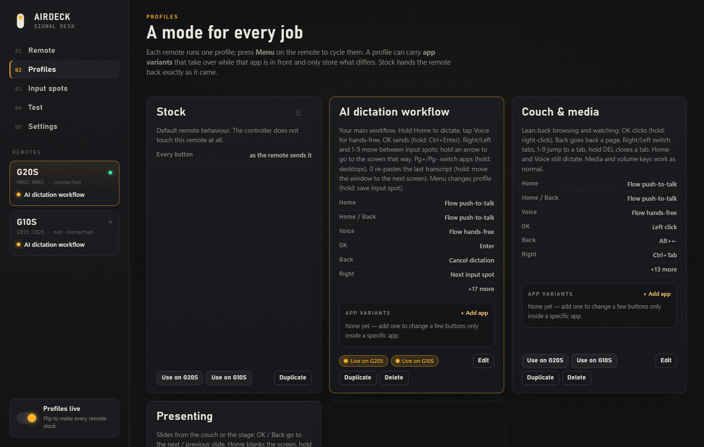
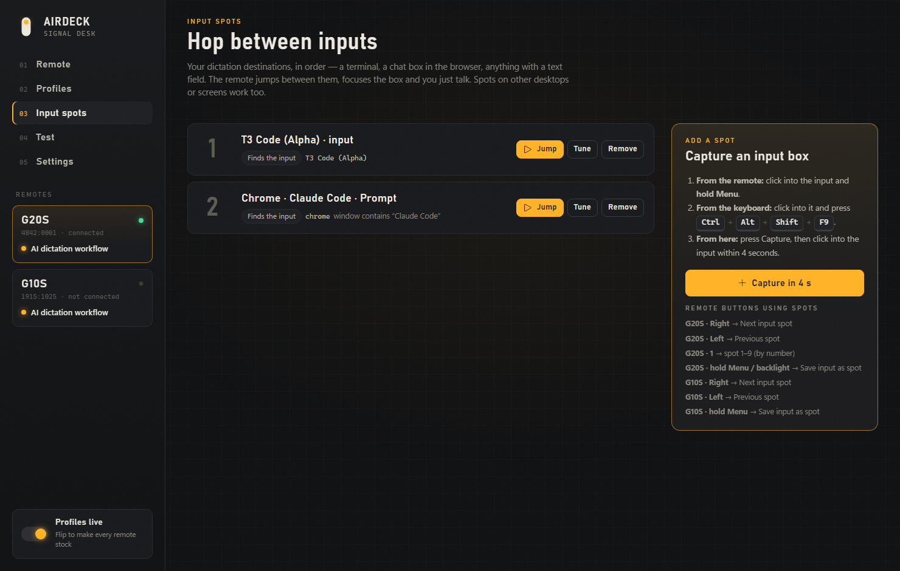
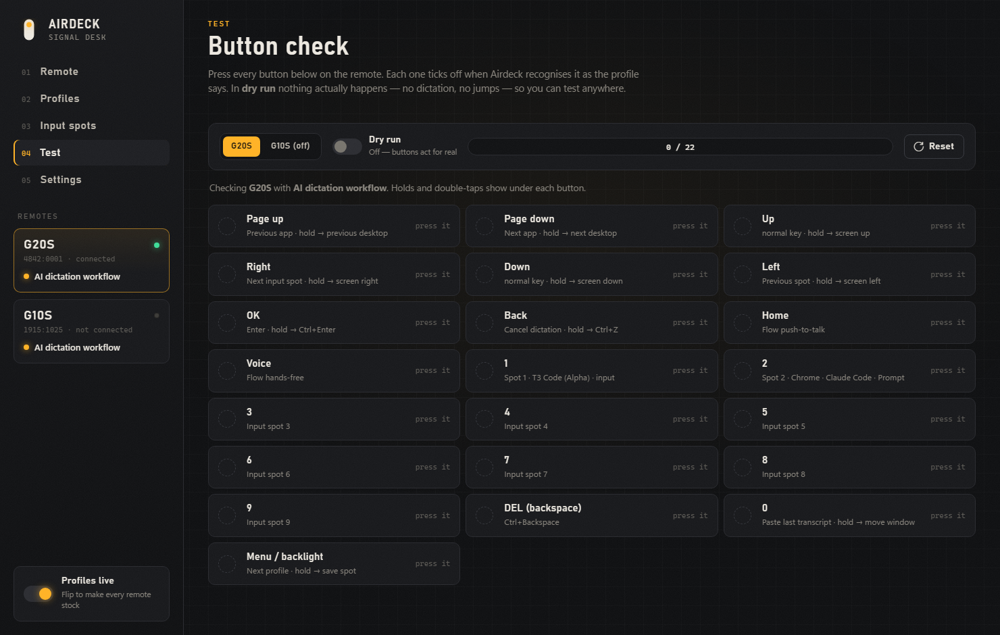
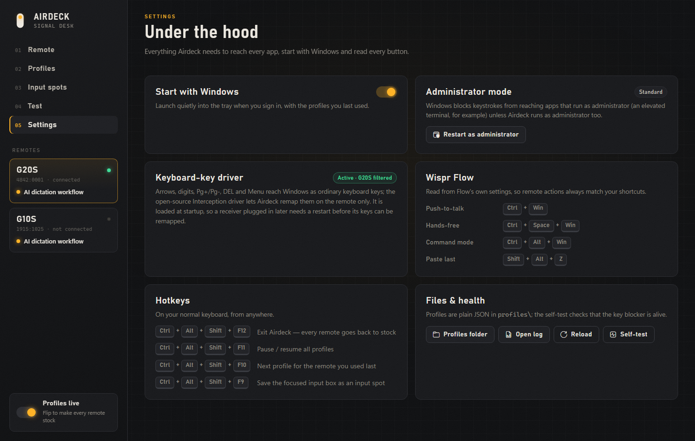

<div align="center">


# Airdeck

**Turn a cheap air-mouse remote into a handheld controller for AI dictation and your Windows desktop.**

Hold a button to talk to [Wispr Flow](https://wisprflow.ai), hop between the input boxes you dictate into, switch desktops, and send with OK, all from the couch.
The remote only changes meaning when *it* sends a key. Your real keyboard is never touched.



</div>

## Why

Voice-first AI tools (Wispr Flow, Claude Code, ChatGPT and so on) are much nicer from a sofa than hunched over a keyboard. G20S / G10S air-mouse remotes cost a few dollars, have a gyro pointer, a microphone, and 20–30 buttons. Out of the box, though, their keys are ordinary keyboard keys: remap "Home" and you remap it on your keyboard too.

Airdeck fixes that. It works out **which physical device** each key came from and applies a per-remote **profile**, so the same button can do different things per mode. The **Stock** profile hands the remote back exactly as it came.

## Features

- **Device-specific remapping.** Remote Home = Flow push-to-talk; keyboard Home = still Home.
- **Profiles per remote.** *AI dictation workflow*, *Couch & media*, *Presenting*, *Stock*, or your own. Cycle them from the remote itself (Menu), the app, the tray, or a hotkey. A small notice in the corner tells you where you landed; notices stack in order, and repeats of the same kind update in place.
- **Per-app variants (optional).** A profile can swap in a variant while a given app is in front, for example to give OK a different meaning in one editor. Variants only store what they change. None ship by default, so every button does the same thing everywhere.
- **Tap, hold and double-tap.** Every button can do up to three things. For example, OK sends Enter and holding it sends Ctrl+Enter.
- **Multi-monitor.** Hold an arrow to jump to the screen in that direction (pointer and focus). Hold 0 to throw the current window to the next screen. Screens are found by their real arrangement, so a monitor above works too.
- **Wispr Flow built in.** Push-to-talk (hold), hands-free toggle, command mode and cancel. Flow's shortcuts are read from its own settings.
- **Input spots.** Save the input boxes you dictate into (a VS Code terminal, a browser chat box, anything). The remote hops between them, finds the box with UI Automation (or clicks the remembered spot) and puts the caret there. It even switches to the right browser tab.
- **Desktop control.** App switching (most-recently-used, like Alt+Tab), virtual desktops, shortcuts, text snippets, clicks, launching apps.
- **A live remote view.** Your remote drawn from its real layout, callouts for every mapped button, keys that light up as you press them, and a signal timeline that shows holds vs taps.
- **A Test view** with a dry-run switch. Press every button and watch the checklist fill in without anything actually happening.
- **A guided button mapper** for new remotes. Press each highlighted button once; the results save automatically.
- **Safety first.**
  - `Ctrl+Alt+Shift+F11` pauses everything (all remotes stock).
  - `Ctrl+Alt+Shift+F12` exits.
  - A watchdog releases stuck keys.
  - The UI server is loopback-only and rejects requests from web pages.

<table>
<tr>
<td></td>
<td></td>
</tr>
<tr>
<td></td>
<td></td>
</tr>
</table>

## Supported remotes

| Remote | Receiver (VID:PID) | Status |
|---|---|---|
| G20S / G20S Pro | `4842:0001` | Fully mapped, layout included |
| G10S | `1915:1025` | Fully mapped, layout included |
| Others | any | Run **Airdeck Button Mapper**, add a layout in `remote-templates/` |

What each button actually sends is documented in [remote-button-map.md](remote-button-map.md) and [docs/DISCOVERY-REPORT.md](docs/DISCOVERY-REPORT.md).

A few facts worth knowing about these remotes:
- The Voice button only ever sends a tap, however long you hold it, so Airdeck uses it as a hands-free *toggle*. Home is a true hold and makes a great push-to-talk key.
- The Mouse on/off key, and on the G20S the Mute and Power keys, never reach the PC.

## Install

Requirements: Windows 10/11 x64. Everything else (.NET Framework 4.8, Edge for the app window) ships with Windows.

1. Download or clone this repo.
2. Double-click **`Install-Airdeck.cmd`**. It:
   - builds the app with the C# compiler that ships with Windows;
   - installs it to `%LOCALAPPDATA%\Programs\Airdeck` (no admin needed);
   - adds **Airdeck** and **Airdeck Button Mapper** to the Start menu and an entry in *Settings → Apps*.
3. Plug in your remote's USB receiver and open **Airdeck**.

### Optional, advanced: remap the remote's keyboard keys

The included profiles need no driver: Home, Voice, Back, OK (G20S), volume and media keys are remapped per remote out of the box, and the remotes' arrows and digits keep working normally. The arrows, digits, Pg+/Pg-, DEL and Menu reach Windows as ordinary keyboard keys, and remapping *only the remote's copy* needs the open-source [Interception](https://github.com/oblitum/Interception) filter driver:

1. In the install folder, right-click `tools\install-interception.cmd` and choose **Run as administrator**. It downloads Interception v1.0.1 from its official release and checks the file hash.
2. **Restart Windows.** The driver only works once it has been loaded at boot; until then the remotes' keyboard keys may not respond.

Airdeck only filters the remotes' keyboard interfaces, never your real keyboard. Caveat (a driver limitation): a receiver re-plugged after boot loses its keyboard keys until the next restart. Undo with `tools\uninstall-interception.cmd` and re-plug the receivers.

### Optional: dictating into admin windows

Windows blocks input from normal apps into elevated windows. Use *Settings → Restart as administrator* if you dictate into an elevated terminal.

## Using it

| | |
|---|---|
| **Remote view** | Click a button on the drawing, or just press it on the remote, and pick an action. Changes save instantly. Editing Stock creates your own copy. |
| **Profiles** | Create, duplicate, rename and delete profiles, choose which remote runs which, and optionally add per-app variants. |
| **Test** | Dry run: presses are shown and ticked off, but no action runs. Leaving the view turns it off. |
| **Input spots** | Click into an input anywhere and press `Ctrl+Alt+Shift+F9`, or use the 4-second capture. Drag to reorder. |
| **Hotkeys** | `Ctrl+Alt+Shift+` **F9** save spot · **F10** next profile · **F11** pause all · **F12** exit |
| **Recovery** | `disable-remote-mapping.cmd` / `restart-remote-mapping.cmd` in the install folder |

### The AI dictation workflow profile

| Button | Tap | Hold |
|---|---|---|
| Home | Wispr Flow push-to-talk (while held) | |
| Voice | Wispr Flow hands-free on/off | |
| OK | Enter: send what you dictated | Ctrl+Enter |
| Back | Cancel the dictation | Undo (Ctrl+Z) |
| Right / Left | Next / previous input spot | Go to the screen on the right / left |
| Up / Down | Normal arrows | Go to the screen above / below |
| Pg+ / Pg- | Previous / next app (keep pressing to walk further back, like Alt+Tab) | Desktop to the left / right |
| 1–9 | Jump straight to input spot *n* | |
| 0 | Paste the last Flow transcript | Move the window to the next screen |
| DEL | Delete the previous word | |
| Menu | Next profile | Save the focused box as an input spot |
| Volume, media keys | Unchanged | |

Home, Voice, OK and Back work without any driver. The arrows, digits, Pg±, DEL and Menu need the optional keyboard-key driver above. Volume and media keys are left alone on purpose: Windows reads them straight from the remote, so remapping them would still change the volume or skip tracks. That is also why app switching lives on Pg± and not on Next/Previous.

### Other profiles

- **Couch & media.** OK clicks (hold: right-click), Back goes back a page, Right/Left switch tabs, 1–9 jump to a tab, 0 opens a new tab, hold DEL closes one. Home and Voice still dictate.
- **Presenting.** OK / Back go to the next / previous slide, Home blanks the screen, hold Menu starts the slideshow.
- **Stock.** The remote exactly as it came. The Menu cycle skips it; use `Ctrl+Alt+Shift+F11` or the app to go stock.

## Profiles are plain JSON

```json
{
  "name": "My mode",
  "description": "What it is for",
  "buttons": {
    "home":  { "action": "flow_ptt" },
    "mic":   { "action": "flow_handsfree" },
    "ok":    { "action": "keys", "keys": "enter", "hold": { "action": "keys", "keys": "ctrl+enter" } },
    "right": { "action": "spot_next", "hold": { "action": "screen_focus", "dir": "right" } },
    "num_1": { "action": "spot_goto", "spot": 1 },
    "page_down": { "action": "app_next", "double": { "action": "desktop_next" } },
    "menu":  { "action": "profile_next" }
  },
  "apps": { "Code": "my-mode-vscode" }
}
```

A variant is a profile with `"extends": "my-mode"` and `"hidden": true` that lists only the buttons it changes. `apps` maps a process name (without `.exe`) to the variant used while that app is in front.

Actions:
- **Wispr Flow:** `flow_ptt`, `flow_handsfree`, `flow_command`, `flow_cancel`, `flow_paste_last`.
- **Input spots:** `spot_next`, `spot_prev`, `spot_goto`, `spot_capture`.
- **Windows and screens:** `app_next`, `app_prev`, `desktop_next`, `desktop_prev`, `screen_focus` and `window_to_screen` (with `"dir"`: `left`, `right`, `up`, `down`, or `next` for moving windows).
- **Keys and text:** `keys`, which stays held while the button is held, and `text`.
- **Mouse:** `left_click`, `right_click`, `middle_click`.
- **Airdeck and system:** `profile_next`, `run`, `block`, and `passthrough` (the default).

Any action can carry `hold` and `double` sub-actions. A button with gestures waits briefly (450 ms for a hold, 280 ms for a double-tap) before acting on a plain tap.

Button ids come from [remote-devices.json](remote-devices.json).

## How it works

- **Consumer-control keys** (Home, Back, Voice, media, volume) arrive as a raw HID report from the remote's receiver. Windows then turns the report into a virtual key (Browser_Home, …) a few milliseconds later, with no source device. Airdeck reads the report through Raw Input, which says which device it came from. It then blocks only the virtual key that follows a *mapped* report, using a low-level keyboard hook. The same key from any other keyboard has no report in front of it and passes through.
- **Keyboard keys** can't be told apart that way. With Interception installed, Airdeck filters only the remotes' keyboard interfaces. It swallows mapped strokes and passes everything else straight through.
- **Actions** are sent with `SendInput` and tagged, so Airdeck never reacts to its own keys. Win-key chords are released with a masking key, so the Start menu never pops open.
- **The app window** is plain HTML/CSS/JS served by the tray app on `127.0.0.1:47800`. It opens as a standalone Edge app window, and live button presses stream over server-sent events. The API requires a custom header and the right Host, so ordinary web pages can't call it.

## Building from source

```powershell
powershell -ExecutionPolicy Bypass -File tools\build.ps1    # airdeck.exe, airdeck-mapper.exe, hidtool.exe -> tools\bin
powershell -ExecutionPolicy Bypass -File install.ps1        # install/update for the current user
```

| Path | |
|---|---|
| `tools/src/` | C# 5 sources, compiled with the .NET Framework `csc` that ships with Windows (no SDK) |
| `ui/` | The app window |
| `profiles/` | Default profiles |
| `remote-templates/` | Remote layouts (drawing + mapper steps) |
| `remote-devices.json` | Button signatures, generated by `tools/export-button-map.ps1` from a mapper capture |
| `tools/hidtool.exe` | `hidtool enum` / `hidtool monitor`, a raw HID inspector for new hardware |

## Adding a remote

1. Add `remote-templates/<id>.json` with its VID/PID, layout and mapping steps. The two included files are good starting points.
2. Run **Airdeck Button Mapper** and press each highlighted button. The results go to `data/remote-capture.json`.
3. Run `tools/export-button-map.ps1` to regenerate `remote-devices.json`, reinstall, and send a pull request.

## Privacy

Airdeck has no telemetry and makes no network calls. The one exception is the optional Interception download, and only when you run that script yourself. Captures, input spots and logs stay in the install folder.

## License

Airdeck is licensed under the [GNU GPL v3](LICENSE).
Interception is a separate project by Francisco Lopes with its own license. It is not bundled here; the install script downloads it from its official release when you ask for it.
Not affiliated with Wispr Flow or any remote manufacturer.
